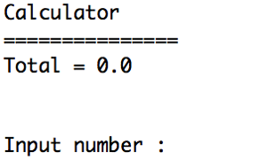
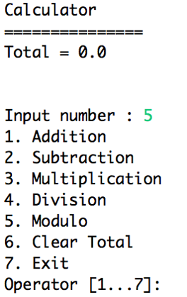
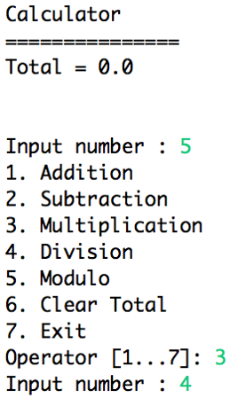
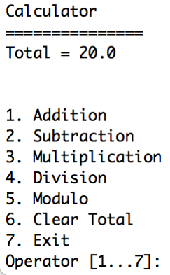

# Java Calculator

&nbsp;&nbsp;&nbsp;&nbsp;&nbsp;&nbsp;&nbsp;&nbsp;&nbsp;&nbsp;&nbsp;&nbsp;&nbsp;&nbsp;&nbsp;&nbsp;&nbsp;&nbsp;

Calculator is a Java library for dealing with number calculation.

This is a simple command-line calculator program written in Java. It provides basic arithmetic operations (addition, subtraction, multiplication, division, modulo) and allows you to clear the total or exit the program.

## Features

- Supports basic arithmetic operations.
- Handles user input errors (non-numeric values, invalid options).
- Provides clear user prompts and error messages in Indonesian.
- Calculates and displays the result.
- Offers options to clear the total or exit the program.

## Instructions

1. Compile the Java code using a Java compiler (e.g., `javac calculator.java`).
2. Run the program from the command line using `java calculator`.

## Usage

The program will prompt you for two numbers and an operation:

1. **First Value:** Enter the first number for the calculation.
2. **Operator:** Select an operation from the following menu by entering the corresponding number:
    - Addition
    - Subtraction
    - Multiplication
    - Division
    - Modulo
    - Clear Total
    - Exit
3. **Second Value:** Enter the second number for the calculation (except for option 6 and 7).

## Error Handling

The program handles non-numeric input and invalid option selections:

- If you enter a non-numeric value for the numbers, it will display an error message in Indonesian and prompt you to enter a valid integer.
- If you enter an invalid option number, it will display an error message and prompt you to enter a number between 1 and 7.

## Output

The program will display the calculated result or a message based on your selection:

- For valid calculations, it will print "Total = " followed by the result.
- For option 6 (Clear Total), it will reset the total to 0.
- For option 7 (Exit), it will end the program execution.

## Additional Notes

- The code currently uses `System.err.println` for error messages. You may consider customizing the error message output format or using dedicated logging libraries for more comprehensive error handling.
- While the code functions well, you can explore enhancements like extending functionality to support floating-point numbers, adding more operations, or implementing a graphical user interface (GUI) for a more interactive experience.

## Built With

Java (no additional libraries or frameworks used in this basic implementation)

I hope this README provides a clear and helpful guide to using your Java calculator!

